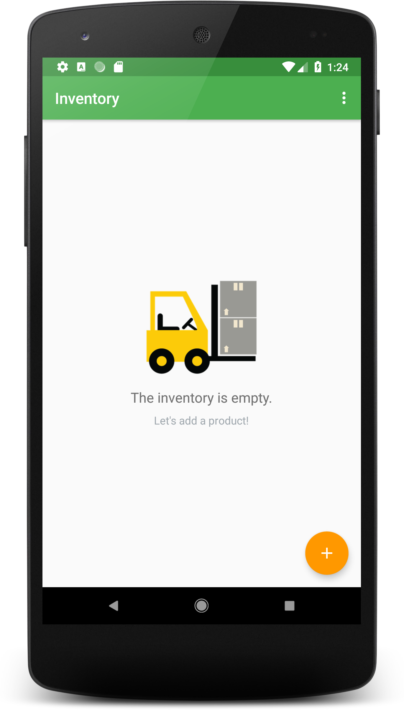
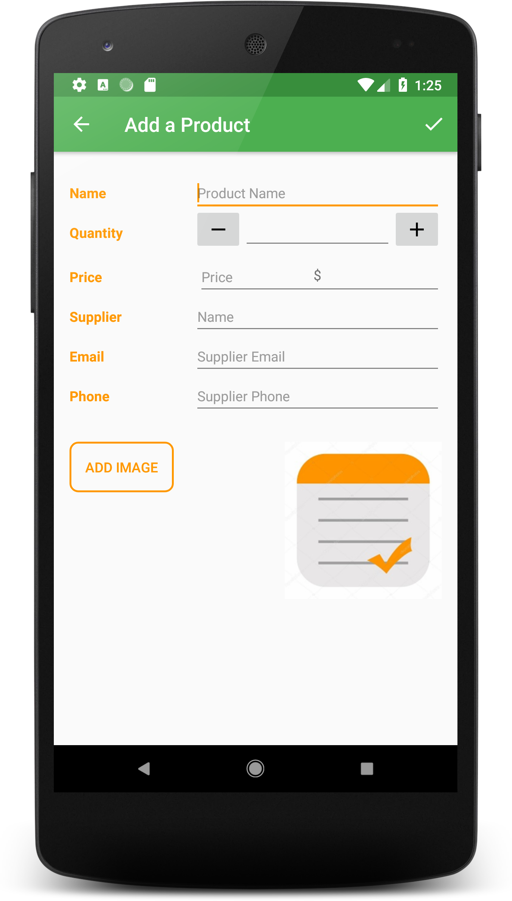
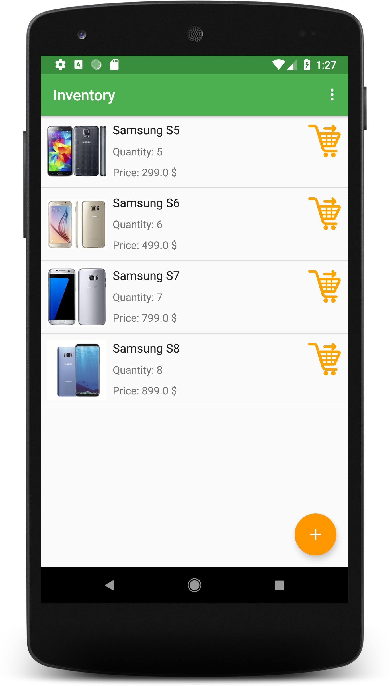
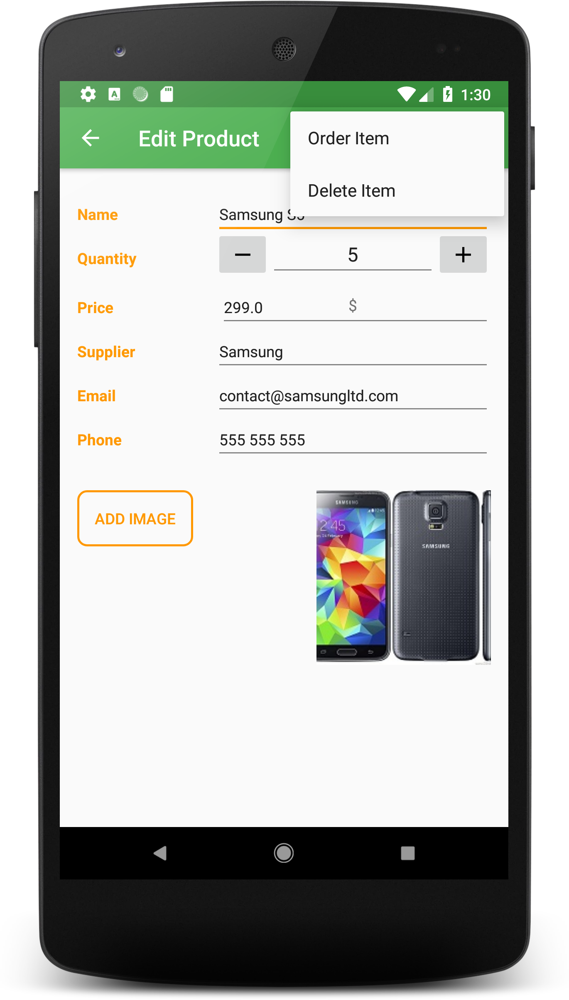
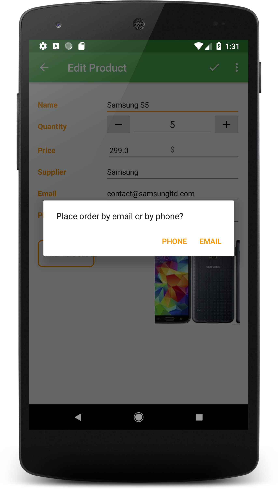
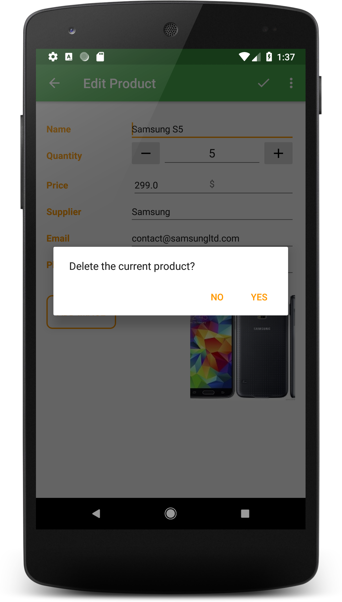

# Android Basics Nanodegree by Google | Udacity Project 8: Inventory App
This app allows a store to keep track of its inventory of products. It stores information about price, quantity available, supplier, and a picture of the product, using a SQLite database. 

  

It also allows the user to track sales and shipments and make it easy for the user to order more from the listed supplier.

  
